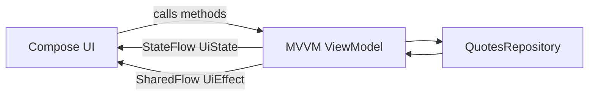

# MVVM vs MVI (Jetpack Compose) — Same Feature, Two Architectures

A small Android app that implements the **same Quotes feature** in two variants:
- **MVVM** (typical Android approach)
- **MVI** (unidirectional data flow: Intent → Result → Reducer → State + Effect)

Goal: understand the practical differences in **state management, one-off events (effects), predictability, and testability**.

---

## Feature (same in both)
Single screen:
- Loads a list of quotes from a fake in-memory repository (delay + random errors)
- **Refresh** button
- Toggle **favorite** by tapping an item
- Shows **snackbar** as a one-off effect ("Loaded", "Load failed", etc.)

---

## Why this showcases MVVM vs MVI
This feature forces the code to handle:
- **UI State**: Loading vs Content (and refreshing)
- **User events**: refresh, toggle favorite
- **Async work**: repository calls (success/failure)
- **One-off effects**: snackbar (must not repeat on recomposition)

---

## Architecture Overview

### MVVM
- UI calls ViewModel methods (`onRefreshClicked`, `onToggleFavorite`)
- ViewModel updates `StateFlow<UiState>` directly
- One-off effects are emitted via `SharedFlow<UiEffect>`

**MVVM flow**


### MVI
- UI sends Intent to a Store/ViewModel (accept(intent))
- Store executes async work and emits Result
- Reducer is a pure function: State + Result -> State
- One-off actions are emitted as Effect

**MVI flow**
```mermaid
flowchart LR
  UI[Compose UI] -->|Intent| Store[MVI ViewModel/Store]
  Store -->|Result| Reducer[Reducer reduce(State, Result)]
  Reducer -->|State| Store
  Store -->|StateFlow State| UI
  Store -->|Effect Flow| UI
  Store --> Repo[QuotesRepository]
  Repo --> Store